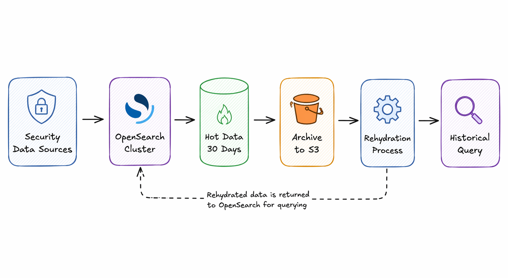
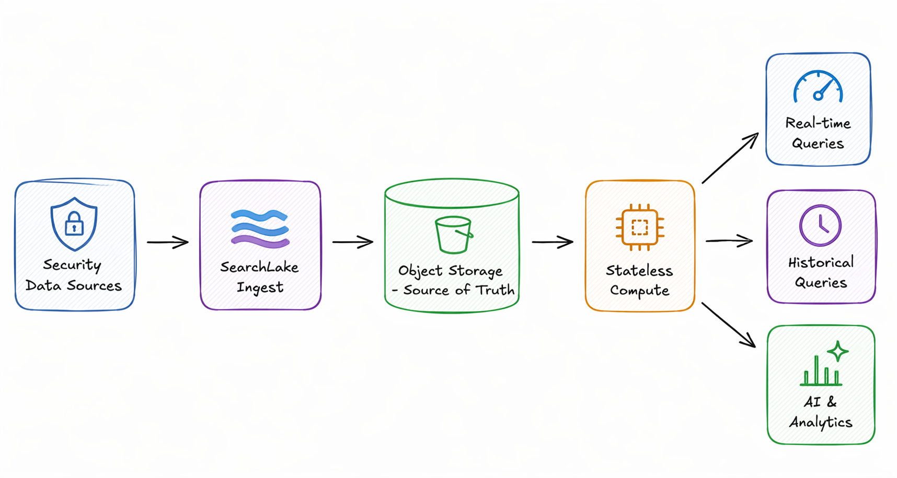
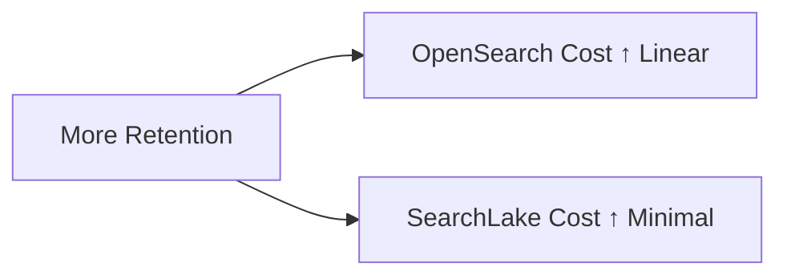
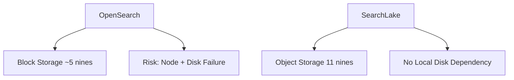

# SearchLake vs. OpenSearch  
## Reimagining Security Data Infrastructure  

> **A customer-facing white paper for Data Architects and CISOs**

---

# 🚀 Executive Summary

Security teams today face a fundamental trade-off:

- More data = better detection and forensics  
- More data = higher cost and complexity  

Traditional systems like OpenSearch force compromises:
- Short retention (30 days)
- Expensive block storage
- Slow historical access

**SearchLake eliminates these trade-offs** by enabling:

- 📦 Unlimited retention  
- 💰 5×–20× lower cost  
- ⚡ Instant historical queries  
- 🛡️ Ultra-high durability  

---

# ⚠️ The Problem

## Traditional Architecture

### Key Issues

- ❌ Only recent data is readily accessible
- ❌ Historical queries are slow
- ❌ Cost baloons with retention 
- ❌ Heavy operational overhead

---

# 💡 The SearchLake Approach

## Modern Architecture

### Key Advantages

- ✅ No hot vs cold split  
- ✅ No rehydration  
- ✅ Infinite scale  
- ✅ Elastic compute  

---

# 💰 Cost Model Comparison

### OpenSearch

- Storage = block (expensive)  
- Needs replicas  
- Compute tied to data  

### SearchLake

- Storage = object (cheap)  
- Ultra-compressed  
- Compute decoupled  

---

# 🛡️ Durability Comparison

### Impact

- OpenSearch: higher data loss risk  
- SearchLake: near-zero loss probability  

---

# ⚙️ Operations Comparison

| Capability | OpenSearch | SearchLake |
|-----------|-----------|-----------|
| Scaling | Manual | Automatic |
| Upgrades | Risky | Safe |
| Retention | Expensive | Cheap |
| Architecture | Stateful | Stateless |

---

# 🔄 Transformation

## From

- Hot + cold silos  
- Limited retention  
- Expensive clusters  

## To

- Unified data platform  
- Full-history search  
- Elastic infrastructure  

---

# 🎯 Strategic Impact

## For CISOs

- Better visibility  
- Faster response  
- Lower risk  

## For Data Architects

- Simpler systems  
- No capacity planning  
- Infinite scalability  

---

# 🧠 Final Thought

> Future outcomes depend on data availability.

SearchLake ensures:

- Data is never lost  
- Data is always accessible  
- Data is economically sustainable  

---

# 📞 Call to Action

Evaluate:

- Cost of extending retention  
- Time to investigate historical incidents  
- Operational overhead

SearchLake enables:

- Lower cost  
- Higher resilience  
- Better data-driven outcomes

---

**End of White Paper**
